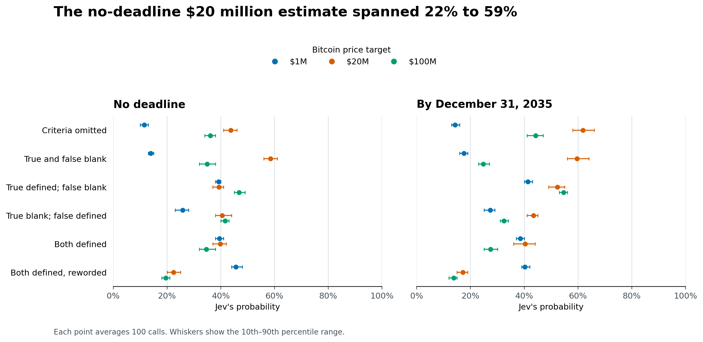
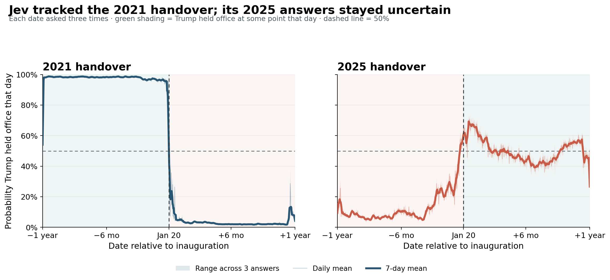
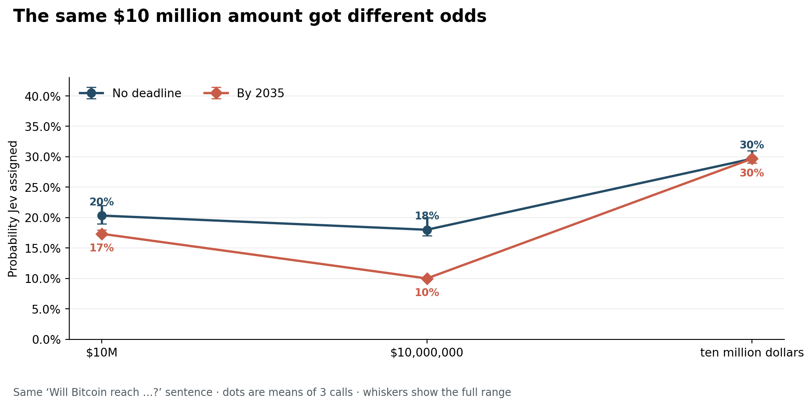

+++
title = "How Well Calibrated Are Jev’s Probabilities?"
date = 2026-09-21
draft = false
tags = ["ai", "forecasting", "probability", "bitcoin"]
description = "Jev gave Bitcoin a higher chance of reaching $100 million than $1 million. The event definition moved the odds too."
ShowToc = false
+++

Jev is an AI forecasting service that assigns probabilities to yes-or-no questions. Each question can include `true` and `false` text defining what counts as yes or no. With no deadline and both fields set to empty strings, Jev gave **35%** to `bitcoin will reach 100 million` and **14%** to `bitcoin will reach 1 million`, averaging 100 calls each.

Calibration asks whether forecasts assigned 20% come true about one time in five across many independent events.

Reaching $100 million means passing $1 million, so the higher target should get the lower probability. Jev assigned it 2.5 times the $1 million estimate.

I then filled both fields with matching definitions: a hit at least once in the period for “true,” and no hit for “false.” The no-deadline $20 million estimate went from 59% to 40%; at $1 million, it went from 14% to 39%.

The chart sweeps 17 Bitcoin targets from $50,000 to $100 million, with every year-end deadline from 2026 through 2050 plus no deadline. Each point averages 100 calls. Select a year to focus its line while the no-deadline line stays visible; whiskers show the 10th–90th percentile range.

<iframe src="/posts/jev-calibration/bitcoin-sweep.html" title="Bitcoin target probabilities by year and criteria" style="width:100%;height:620px;border:0" loading="lazy"></iframe>

## What each criteria field did

I compared six versions of the same prompt: criteria omitted, both fields blank, only `true` filled, only `false` filled, both defined, and a reworded definition. Each setup was tested at three targets, with no deadline and by December 31, 2035, 100 calls per point. The no-deadline $20 million estimate ranged from 22% to 59%.

The [full Bitcoin sweep](bitcoin_100_full_sweep.csv), [criteria comparison](criteria_factorial.csv) and [exact criteria requests](criteria_factorial_raw.jsonl) include every repeat. [Run details](bitcoin_100_sweep_manifest.json).

The effect also appeared on two known historical claims. Across six criteria setups, the mean for Trump’s presidency on January 21, 2025 ranged from 68% to 89%; for January 21, 2021, it ranged from 6% to 37%. Each estimate stayed on the correct side of 50%. Each setup had 100 calls. See the [full comparison](historical_criteria_summary.csv), [all 1,200 answers](historical_criteria.csv) and [their exact requests](historical_criteria_raw.jsonl).

## A deadline often raised the odds

I tested 18 instruments: the top holding in each of State Street’s 11 sector ETFs; GME, AMC and Tesla; and SPY, QQQ, Bitcoin and Ethereum. For each, Jev estimated whether the price would reach 2×, 10×, 100× or 1,000× its September 2026 price, with no deadline or by December 31, 2035. Every combination averages 100 calls.

With event definitions supplied, the 2035 probability topped the no-deadline probability in **69 of 72 comparisons**. Reaching a target by 2035 is one way to reach it in the future, so its probability should be no higher. With criteria blank, the average rose as the target rose in 14 of 108 adjacent comparisons; with definitions supplied, it never did.

Among the 11 sector leaders, Jev gave NVIDIA the highest 10× by-2035 estimate, **54%**; Caterpillar got the lowest, **15%**. Use the chart to compare all 18 lines by instrument, criteria and deadline.

<iframe src="/posts/jev-calibration/asset-sweep.html" title="Price target probabilities across 18 financial instruments" style="width:100%;height:900px;border:0" loading="lazy"></iframe>

[All 28,800 instrument forecasts](asset_sweep.csv), [cell averages](cell_summary.csv) and the [selection table](asset_selection_frame.csv) are available. Holdings are from September 17, 2026. [State Street’s ETF list](https://www.ssga.com/uk/en_gb/intermediary/capabilities/equities/sector-investing/select-sector-etfs) shows the 11 sectors.

## A known date, three different answers

On January 21, 2025, Donald Trump was president, according to the [National Archives chronology](https://www.archives.gov/research/census/presidents). Across 62 hand-picked facts, Jev’s probabilities landed on the correct side of 50% for 57. For that date, it gave 20% to “Donald Trump was president” and 93% to “Joe Biden was president.” On January 21, 2026, it gave 49% to Trump being president.

Around both inaugurations, I asked “Was Donald Trump President of the United States on [date]?” as a probability question and a YES/NO choice. I also asked “Who was President of the United States on [date]?” with Trump, Biden and “Someone else” as choices. On January 21, 2025, the probability averaged 57%; the other two answers were “Yes” and “Donald Trump” in all three calls.

The chart covers every day in the year before and after the 2021 and 2025 handovers. Download the [date-by-date results](president_daily_3rep_sweep.csv) and the [62 claims, with sources and estimates](factual_claim_means.csv). Each fact claim averages three calls.

## $10M, $10,000,000, ten million

For the same no-deadline $10 million target, Jev gave “$10M” 20%, “$10,000,000” 18% and “ten million dollars” 30%. With a 2035 deadline, those estimates were 17%, 10% and 30%. Each spelling was tested three times.

This comes from a larger wording sweep across eight number formats, eight sentence forms and three targets. [All 1,152 answers](notation_sweep.csv).

## Political labels, war outcomes

For Taiwan, Jev gave 91% to “Does Taiwan have its own elected government and exercise its own administration?”, 24% to “Is Taiwan a sovereign independent country?” and 30% to “Is Taiwan a country?” It gave 2% to “Does Iran belong to Palestine?” and 97% to “Is Iran a sovereign state?” [The 22 claims and three answers to each](contested_claims.csv) preserve the exact wording.

“Will Ukraine win its war with Russia?” averaged 36%; “Will Russia win its war with Ukraine?” averaged 31%. By 2030, Jev gave 28% to a decisive Ukrainian victory, 27% to a decisive Russian victory and 58% to neither side achieving one. Each answer averages three calls. [All eight war questions](war_mirror_forecasts.csv).

## The probabilities did not add up

I asked related binary-probability questions together and repeated each group 100 times, with criteria omitted, left blank or defined. A shared instruction said a Bitcoin target counts as reached when a BTC/USD daily close meets or exceeds it. The $100 million probability stayed below $1 million, and the 2030 estimate stayed below the 2035 estimate in every repeat.

The two opposite answers in each column should add to 100%. These are the average totals across 100 calls:

| Criteria fields | Reach + fail ($1M by 2035) | Above + at/below ($1M on Dec. 31, 2035) |
|:--|--:|--:|
| Omitted | 102% | 97% |
| Both blank | 93% | 91% |
| Both defined | 97% | 96% |

With both fields blank, Jev gave 6% to reaching both $1 million and $10 million by 2035, and 3% to reaching $10 million. Those events have the same outcomes. [The 100-repeat logic results](logic_100.csv) and [exact requests and answers](logic_100_raw.jsonl).

The fact, presidency, wording and contested-claim checks ran September 20, 2026. The Bitcoin sweeps ran September 21; the instrument sweep ran September 20–21. All responses identify Jev 1.13.0.

## What is Jev reading into the question?

The $100 million estimate beating $1 million is the clearest puzzle. Deadlines often raised the odds across the instruments, and criteria wording moved the presidential estimates by as much as 31 points. The next question is what Jev reads into those fields and time limits.
